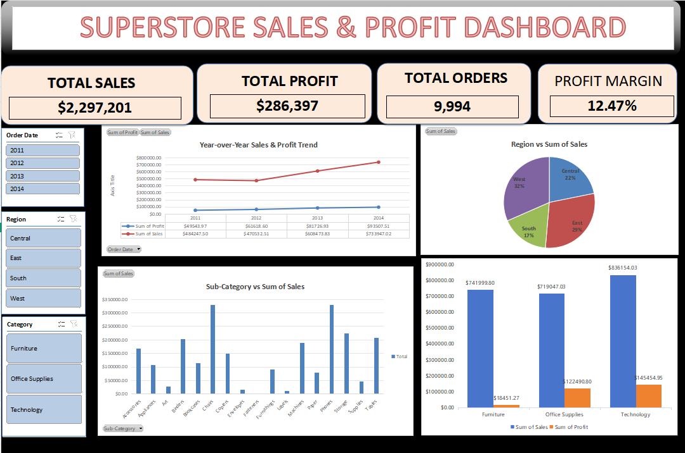

# Superstore Sales & Profit Performance Dashboard (Excel)

## Project Overview
This project presents an interactive Excel Data Analytics Dashboard created from the Kaggle US Superstore Sales dataset. The primary goal is to analyze business revenue, profitability metrics, regional demand, and sub-category performance to identify growth drivers and underperforming segments.

---

## Key Performance Indicators (KPIs)
- **Total Revenue:** $2.30M
- **Total Profit:** $286.4K
- **Profit Margin:** 12.47%
- **Total Orders Processed:** 9,994

---

## Dashboard Preview

---

## Key Business Insights
1. **Category Profitability:** Technology yields the highest revenue ($836K) and profit ($145.4K). Furniture generates substantial sales ($742K) but operates on slim profit margins ($18.4K).
2. **Top Performing Products:** Technology accessories and copiers (e.g., Canon imageCLASS 2200) account for major individual revenue spikes.
3. **Regional Distribution:** West and East regions drive over 61% of total nationwide sales volume.

---

## Tech Stack & Tools
- **Data Source:** Kaggle Superstore Dataset
- **Analytics Tool:** Microsoft Excel / WPS Spreadsheets
- **Features Used:** Pivot Tables, Data Modeling, Dynamic Slicers, Custom Formats, Interactive Charting

---

## How to View
1. Download the `Superstore.xlsx` file from this repository.
2. Open in Microsoft Excel or WPS Office to interact with the dynamic year/region/category slicers.
